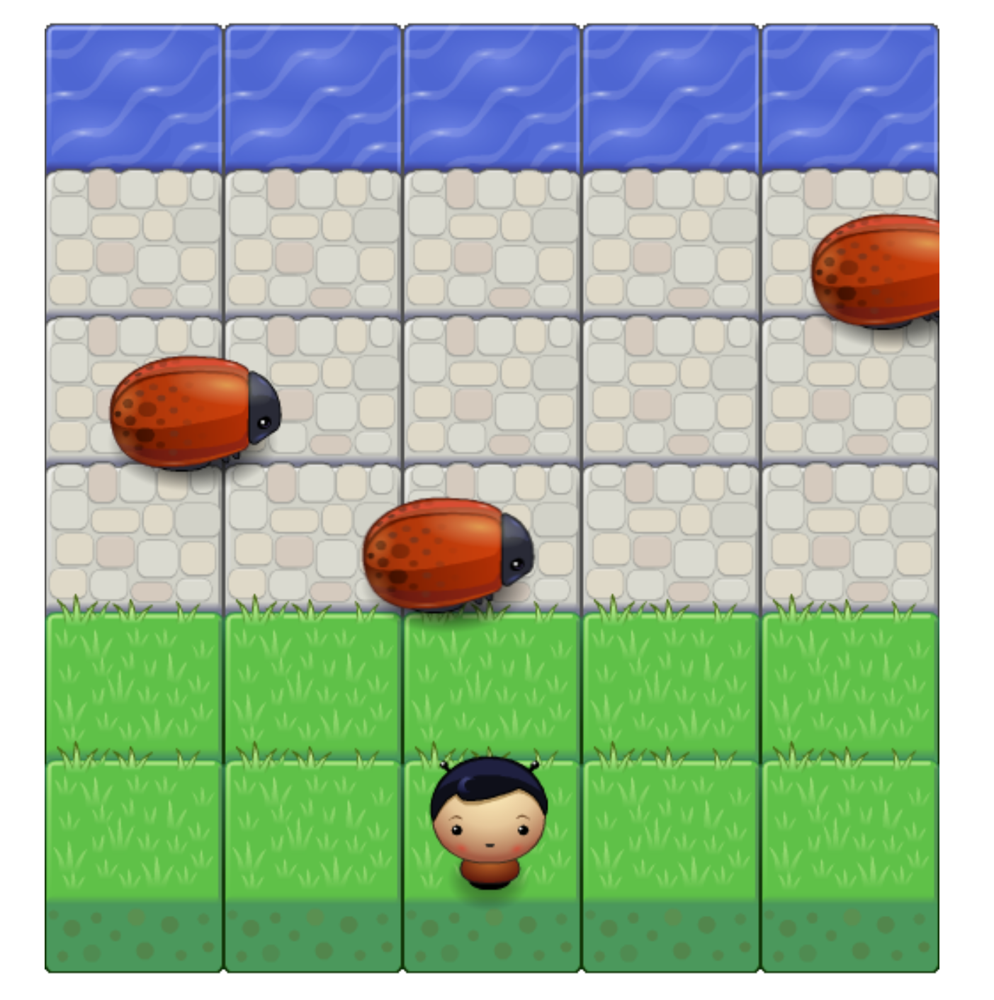

# Frogger Arcade Game

This is a simple clone of classic frogger arcade game, and it is the first project from Udacity Front End Nanoegree.
Udacity provides the game engine and the graphics. I have completed the creation and instantiation of enemy and player class using object oriented javascript knowledge, and developed the logics for player movements and win/lose check.

### How to play the game
- The goal is to make the player reach the river by moving the player across the grass and bricks 
- Try to avoid collision with the flying bugs, or you'll lose the game
- Control the movements of the player by pressing the up/down/left/right keyboards

# Installation

  - Download and unzip the zip file of the project
  - Open the index.html file using your browser

# Relevant Techniques 
- object oriented javascript
- HTML5 canvas

